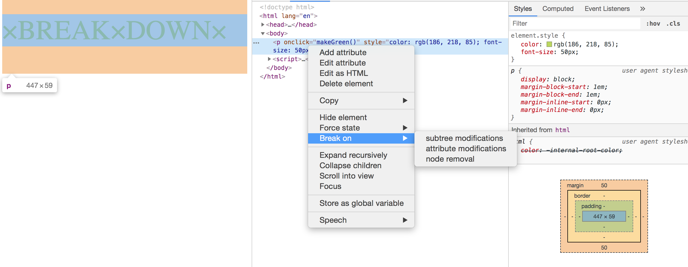

# Notes

- Debugging each line of JavaScript that is changing an HTML element

- Styling
```javascript
console.log('%c I am some great text', 'font-size: 50px');
```
- Warning
```javascript
console.warn('OH NOOOO');
```
- Display error + log trace
```javascript
console.error('Error!');
```
- Info
```javascript
console.info('Crocodiles eat 3-4 people per year!');
```
- Testing
```javascript
console.info('Crocodiles eat 3-4 people per year!');
```
- Clearing console
```javascript
console.clear();
```
- Viewing HTML elements in dropdown format
```javascript
console.dir(p);
```
- Grouping together: `group()` and `groupCollapsed()`
```javascript
dogs.forEach(dog => {
        console.group(dog.name);
        console.log(`This is ${dog.name}`);
        console.log(`${dog.name} is ${dog.age} years old`);
        console.groupEnd(dog.name);
});
```
- Counting
```javascript
console.count('ramigs');
console.count('ramigs');
console.count('ramigs');
```
- Timing
```javascript
console.time('fetching data');
    fetch('https://api.github.com/users/ramigs')
        .then(data => data.json()
        .then(data => {
            console.timeEnd('fetching data');
            console.log(data);
    }));
```
- Display as table
```javascript
console.table(dogs);
```